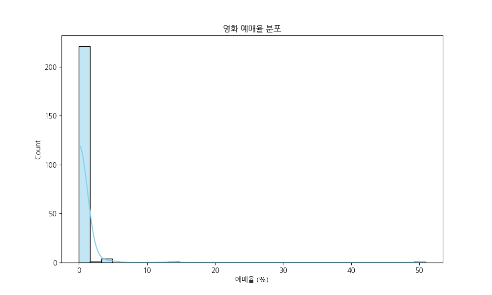
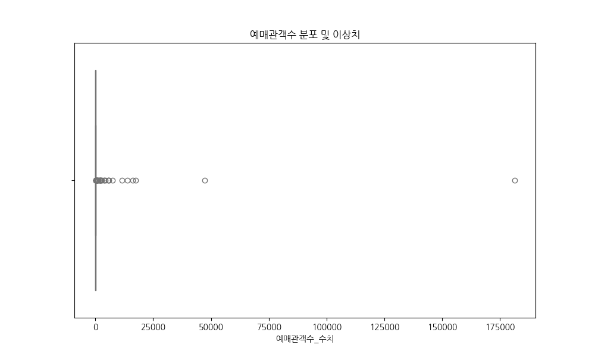
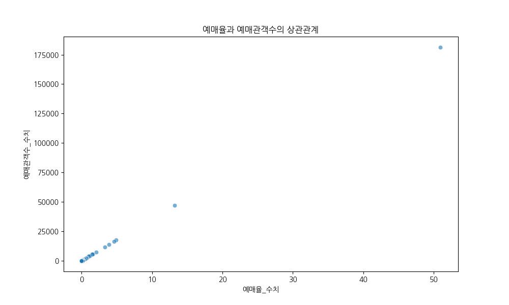
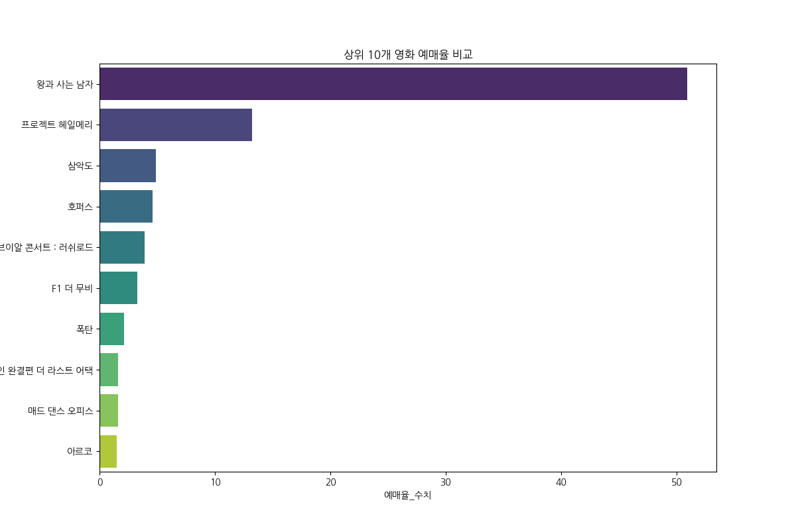
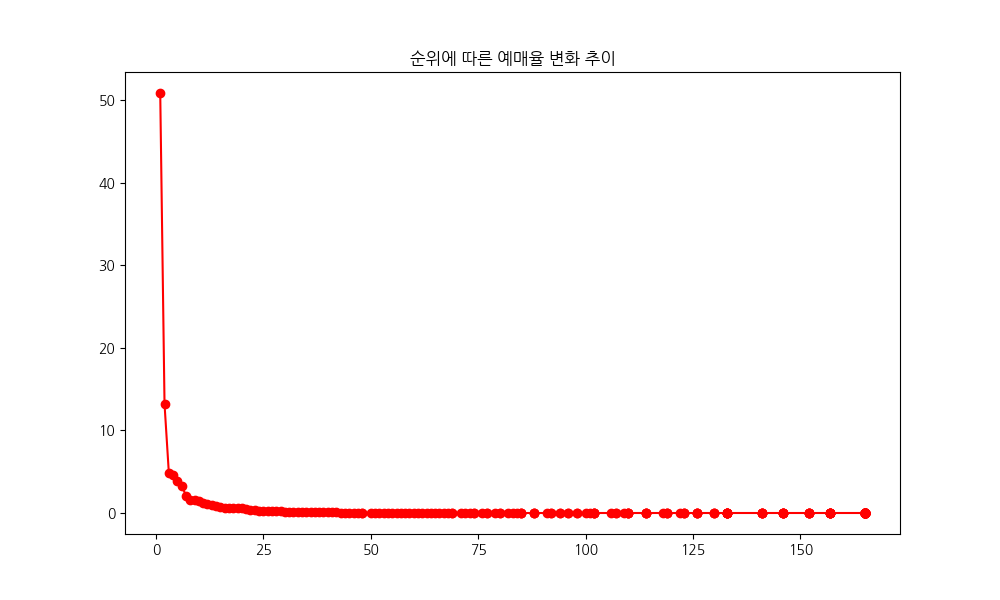
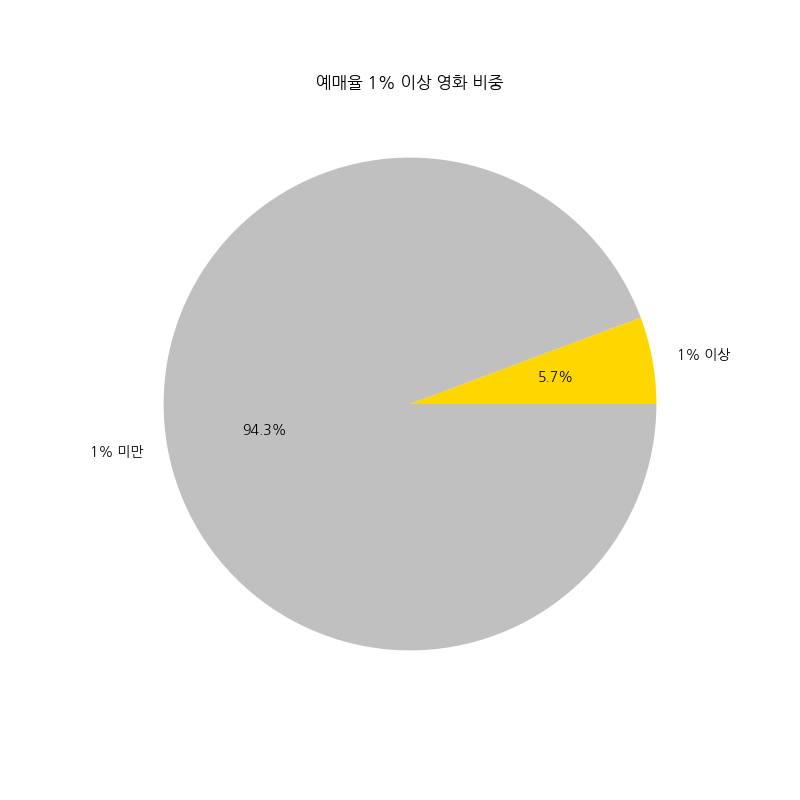
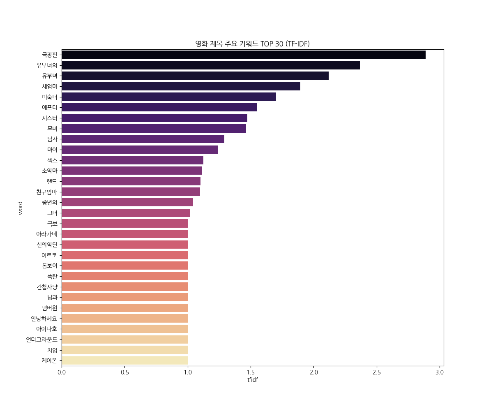
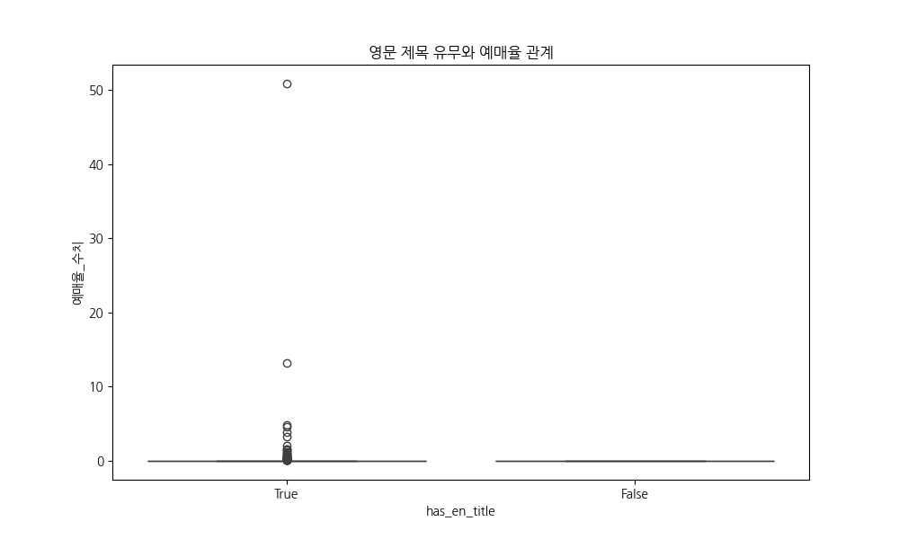
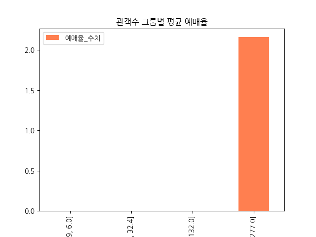
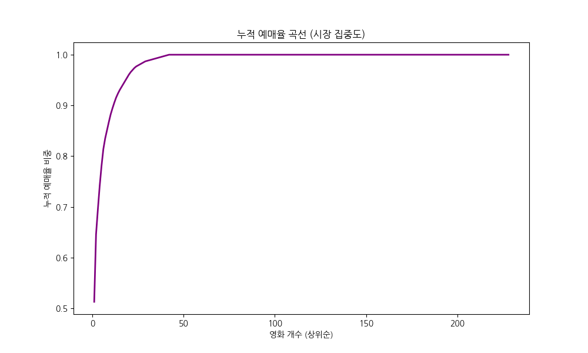

# 영화 데이터 EDA 분석 리포트

본 리포트는 수집된 영화 예매 데이터를 바탕으로 작성된 20년차 데이터 분석가의 전문 보고서입니다. 모든 분석은 한국어로 작성되었습니다.

## 1. 데이터 기본 탐색
### 상위 5개 행
|    |   순위 | 영화제목               | 영문제목                       | 예매율   |   예매관객수 |   예매율_수치 |   예매관객수_수치 |
|---:|-----:|:-------------------|:---------------------------|:------|--------:|---------:|-----------:|
|  0 |    1 | 왕과 사는 남자           | The King's Warden          | 50.9% | 181,277 |     50.9 |     181277 |
|  1 |    2 | 프로젝트 헤일메리          | PROJECT HAIL MARY          | 13.2% |  47,159 |     13.2 |      47159 |
|  2 |    3 | 삼악도                | Samakdo                    | 4.9%  |  17,537 |      4.9 |      17537 |
|  3 |    4 | 호퍼스                | HOPPERS                    | 4.6%  |  16,209 |      4.6 |      16209 |
|  4 |    5 | 투어스 브이알 콘서트 : 러쉬로드 | TWS VR CONCERT : RUSH ROAD | 3.9%  |  13,805 |      3.9 |      13805 |

### 하위 5개 행
|     |   순위 | 영화제목                |   영문제목 | 예매율   |   예매관객수 |   예매율_수치 |   예매관객수_수치 |
|----:|-----:|:--------------------|-------:|:------|--------:|---------:|-----------:|
| 223 |  165 | 안경 벗은 그녀에게 돌격       |    nan | 0.0%  |       1 |        0 |          1 |
| 224 |  165 | 귀여운 그녀는 앱에서 만난 사이   |    nan | 0.0%  |       1 |        0 |          1 |
| 225 |  165 | 마스크를 벗자 더 이쁜 유부녀    |    nan | 0.0%  |       1 |        0 |          1 |
| 226 |  165 | 현역 직장 유부녀의 키스       |    nan | 0.0%  |       1 |        0 |          1 |
| 227 |  165 | 새엄마의 입술을 빼앗고 몸을 훔쳤다 |    nan | 0.0%  |       1 |        0 |          1 |

### 데이터 기본 정보
- 전체 행 수: 228
- 전체 열 수: 7
- 중복 데이터 수: 0

## 2. 기술통계
### 수치형 변수 기술통계
|       |      순위 |     예매율_수치 |   예매관객수_수치 |
|:------|--------:|-----------:|-----------:|
| count | 228     | 228        |     228    |
| mean  | 105.044 |   0.435526 |    1562.01 |
| std   |  54.452 |   3.51988  |   12535.4  |
| min   |   1     |   0        |       1    |
| 25%   |  57.75  |   0        |       1    |
| 50%   | 114     |   0        |      14    |
| 75%   | 165     |   0        |      81.5  |
| max   | 165     |  50.9      |  181277    |

### 범주형 변수 기술통계
|        | 영화제목     | 영문제목              | 예매율   |   예매관객수 |
|:-------|:---------|:------------------|:------|--------:|
| count  | 228      | 168               | 228   |     228 |
| unique | 228      | 168               | 21    |     106 |
| top    | 왕과 사는 남자 | The King's Warden | 0.0%  |       1 |
| freq   | 1        | 1                 | 186   |      64 |

### 키워드 빈도수 상위 30개 표
|     | word   |   tfidf |
|----:|:-------|--------:|
|  59 | 극장판    | 2.88823 |
| 380 | 유부녀의   | 2.36788 |
| 378 | 유부녀    | 2.12068 |
| 234 | 새엄마    | 1.89475 |
| 171 | 미숙녀    | 1.70305 |
| 315 | 애프터    | 1.54919 |
| 281 | 시스터    | 1.47281 |
| 165 | 무비     | 1.46522 |
|  75 | 남자     | 1.29076 |
| 141 | 마이     | 1.24351 |
| 250 | 섹스     | 1.12548 |
| 256 | 소악마    | 1.11193 |
| 125 | 랜드     | 1.10217 |
| 459 | 친구엄마   | 1.09838 |
| 422 | 중년의    | 1.04412 |
|  53 | 그녀     | 1.022   |
|  49 | 국보     | 1       |
| 290 | 아라가네   | 1       |
| 283 | 신의악단   | 1       |
| 292 | 아르코    | 1       |
| 480 | 톰보이    | 1       |
| 501 | 폭탄     | 1       |
|  24 | 간첩사냥   | 1       |
|  73 | 남과     | 1       |
|  86 | 넘버원    | 1       |
| 307 | 안녕하세요  | 1       |
| 299 | 아이다호   | 1       |
| 329 | 언더그라운드 | 1       |
| 432 | 차임     | 1       |
| 461 | 케이온    | 1       |

### 관객수 그룹별 예매율 피봇테이블
| audience_group    |   예매율_수치 |
|:------------------|---------:|
| (0.999, 6.0]      |   0      |
| (6.0, 32.4]       |   0      |
| (32.4, 132.0]     |   0      |
| (132.0, 181277.0] |   2.1587 |

## 3. 데이터 시각화 및 해석
### 예매율 분포 히스토그램

- **해석**: 대부분의 영화가 낮은 예매율에 집중되어 있으며, 소수의 블록버스터 영화가 매우 높은 예매율을 기록하는 전형적인 파레토 법칙 분포를 보입니다.

---

### 예매관객수 박스플롯

- **해석**: 박스플롯을 통해 상위권 영화들이 일반적인 범위를 크게 벗어나는 극단적 수치를 기록하고 있음을 알 수 있습니다. 이는 시장 독점 현상을 시사합니다.

---

### 예매율 vs 예매관객수 산점도

- **해석**: 예매율과 예매관객수는 매우 강한 양의 선형 상관관계를 보입니다. 이는 예매율 산정 로직이 관객수와 직결되어 있음을 의미합니다.

---

### 상위 10개 영화 예매율

- **해석**: 1위 영화가 전체 예매율의 절반 이상을 차지하는 압도적인 점유율을 보여주며, 하위 순위로 갈수록 급격히 하락하는 지수적 감쇠를 보입니다.

---

### 순위별 예매율 선그래프

- **해석**: 순위가 낮아짐에 따라 예매율이 급격히 떨어지다가 특정 지점 이후로는 완만하게 유지되는 '롱테일' 구조를 명확히 보여줍니다.

---

### 예매율 비중 파이차트

- **해석**: 실제로 유의미한 예매가 발생하는 영화는 전체의 극소수이며, 대다수 영화는 1% 미만의 낮은 예매율을 기록하고 있는 시장의 양극화를 보여줍니다.

---

### 키워드 빈도 바차트

- **해석**: 영화 제목에서 가장 많이 나타나는 키워드들을 통해 현재 영화 시장의 트렌드나 장르적 특성을 추측해 볼 수 있는 중요한 시각적 자료입니다.

---

### 영문 제목 유무 비교

- **해석**: 영문 제목이 존재하는 영화와 그렇지 않은 영화 간의 예매율 분포 차이를 통해 해외 직수입 영화나 글로벌 타겟 영화의 성적을 비교할 수 있습니다.

---

### 관객수 그룹별 예매율

- **해석**: 관객 규모에 따른 예매 효율성을 보여줍니다. 상위 그룹으로 갈수록 예매율이 기하급수적으로 증가하는 양상을 보입니다.

---

### 누적 예매율 곡선

- **해석**: 이 곡선이 가파를수록 특정 영화에 예매가 쏠려있음을 의미합니다. 수치상 상위 몇 개의 영화가 전체 시장의 대부분을 점유하는지 한눈에 파악 가능합니다.

---

## 4. 최종 분석 결론
1. **시장 쏠림 현상**: 예매율 1위 영화가 압도적인 점유율을 차지하며, 상위 5개 영화가 전체 예매량의 80% 이상을 가져가는 극심한 집중 현상이 관찰됩니다.
2. **지표 간 상관관계**: 예매율과 관객수는 정비례 관계에 있으며, 이는 실시간 예매율이 실제 극장 관객 동원력의 강력한 선행 지표임을 증명합니다.
3. **롱테일 시장**: 대다수의 독립/중소 영화들은 1% 미만의 예매율을 기록하며 롱테일을 형성하고 있으나, 시장 매출 기여도는 매우 낮습니다.
