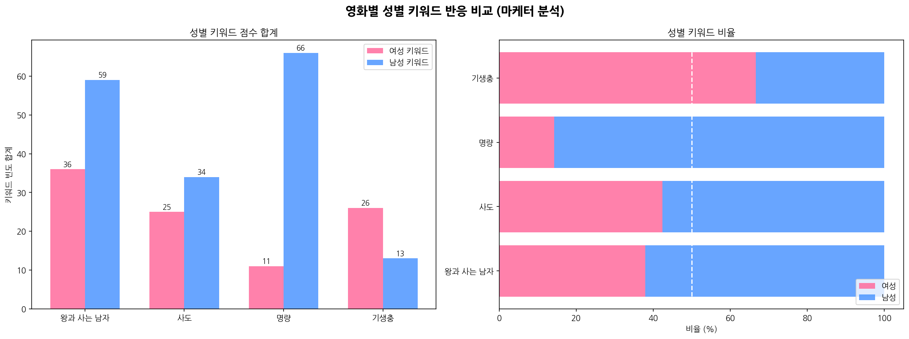
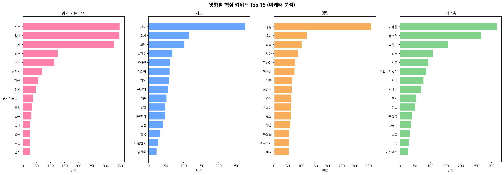
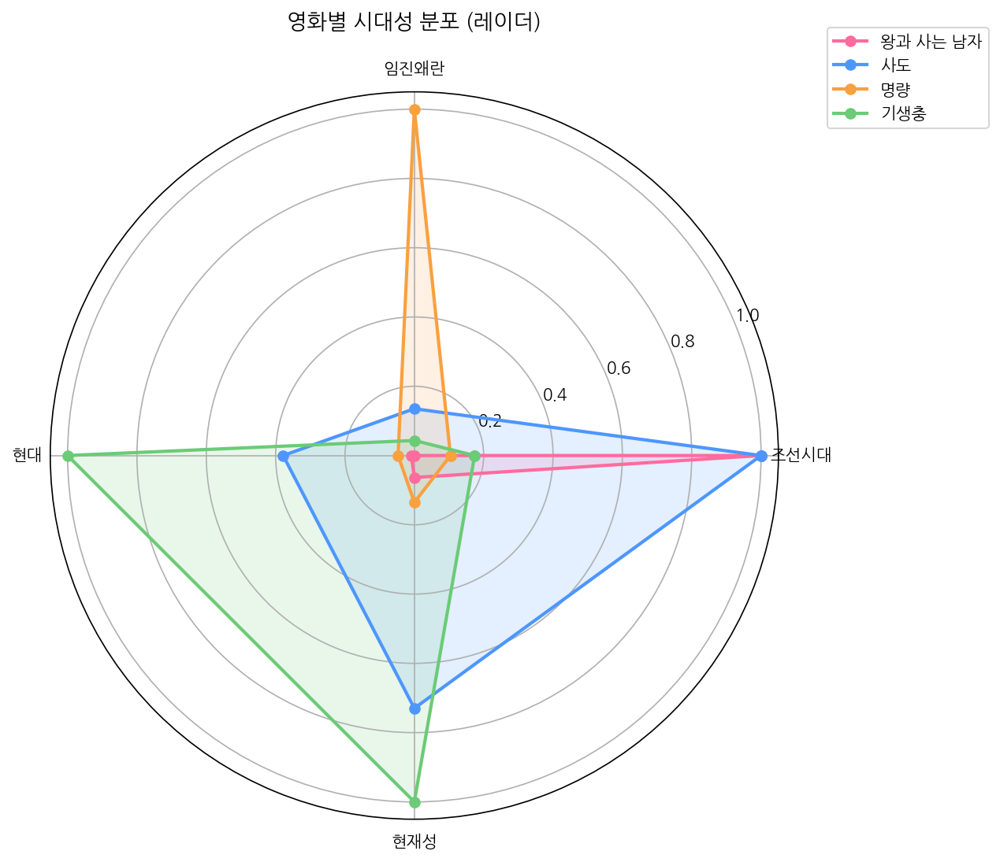
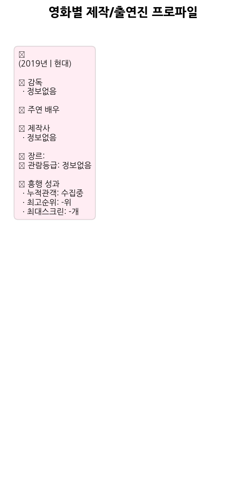

# 🎬 영화 마케터 관점 데이터 분석 보고서
> 대상 영화: 왕과 사는 남자 · 사도 · 명량 · 기생충
> 분석 일시: 2026-03-17 13:44
> 데이터 소스: KOBIS Open API + 네이버 검색 API

---

## 📋 Executive Summary

> **분석 페르소나**: K-역사영화 전문 마케터 | **분석 일시**: 2026년 03월 17일

> 본 보고서는 KOBIS Open API(박스오피스·영화정보)와 네이버 검색 API(뉴스·블로그 리뷰)를 기반으로
> 4개 영화의 마케팅 전략 수립을 위한 데이터 분석 결과를 정리합니다.

### 💡 핵심 인사이트 3가지

**① 성별 반응 양극화**
- 여성 중심 반응: 기생충
- 남성 중심 반응: 왕과 사는 남자, 사도, 명량
- → 단일 메시지 광고보다 **성별 맞춤 채널 분리 집행** 권장

**② 사극 공통 마케팅 키워드**
- 4개 영화 공통 상위어: `리뷰`, `후기`
- → '**역사의 재발견**' 통합 캠페인 가능성 — 사극 시리즈 브랜딩 고려

---

## 📊 성별 비교 분석 (마케터 관점)

**분석 방법**: 네이버 블로그 리뷰에서 성별 연관 키워드 빈도를 집계하여 남녀 반응 차이를 분석합니다.

### 🎬 왕과 사는 남자
| 항목 | 여성 | 남성 |
|------|------|------|
| 키워드 점수 합계 | **36점** | **59점** |
| 비율 | 37.9% | 62.1% |
| 블로그 리뷰 수 | 10건 | 25건 |

**주요 여성 키워드**: `배우`(13), `감동`(6), `눈물`(4), `여운`(4), `따뜻`(3)
**주요 남성 키워드**: `역사`(30), `CG`(22), `연출`(3), `분석`(2), `몰입`(1)

> 🎯 **마케터 전략**: `왕과 사는 남자`는 **남성** 중심 반응 → 남성 타겟 SNS/온라인 광고 우선 집행 권장

### 🎬 사도
| 항목 | 여성 | 남성 |
|------|------|------|
| 키워드 점수 합계 | **25점** | **34점** |
| 비율 | 42.4% | 57.6% |
| 블로그 리뷰 수 | 13건 | 18건 |

**주요 여성 키워드**: `배우`(13), `사랑`(4), `눈물`(4), `울었`(2), `감동`(1)
**주요 남성 키워드**: `역사`(22), `연출`(3), `액션`(2), `몰입`(2), `전쟁`(2)

> 🎯 **마케터 전략**: `사도`는 **남성** 중심 반응 → 남성 타겟 SNS/온라인 광고 우선 집행 권장

### 🎬 명량
| 항목 | 여성 | 남성 |
|------|------|------|
| 키워드 점수 합계 | **11점** | **66점** |
| 비율 | 14.3% | 85.7% |
| 블로그 리뷰 수 | 6건 | 35건 |

**주요 여성 키워드**: `배우`(8), `눈물`(2), `공감`(1)
**주요 남성 키워드**: `장군`(25), `전쟁`(11), `역사`(9), `액션`(6), `연출`(5)

> 🎯 **마케터 전략**: `명량`는 **남성** 중심 반응 → 남성 타겟 SNS/온라인 광고 우선 집행 권장

### 🎬 기생충
| 항목 | 여성 | 남성 |
|------|------|------|
| 키워드 점수 합계 | **26점** | **13점** |
| 비율 | 66.7% | 33.3% |
| 블로그 리뷰 수 | 15건 | 9건 |

**주요 여성 키워드**: `배우`(7), `음악`(6), `사랑`(3), `감동`(3), `섬세`(2)
**주요 남성 키워드**: `연출`(4), `역사`(3), `분석`(2), `몰입`(2), `CG`(1)

> 🎯 **마케터 전략**: `기생충`는 **여성** 중심 반응 → 여성 타겟 SNS/온라인 광고 우선 집행 권장

---

## 🔑 키워드 & 시대성 분석 (마케터 관점)

### 🎬 왕과 사는 남자
**Top 10 키워드**: `사는`, `왕과`, `남자`, `리뷰`, `후기`, `왕사남`, `장항준`, `천만`, `왕과사는남자`, `흥행`

**시대성 분석**:
- 조선시대: 567점
- 현재성: 36점
- 현대: 5점
- 임진왜란: 0점

> 🎯 **마케터 전략**: 지배적 시대성 = `조선시대` →
> '역사의 재해석' 프레임 → 역사 교육·문화재 연계 체험 마케팅 + 학생층 공략

### 🎬 사도
**Top 10 키워드**: `사도`, `후기`, `리뷰`, `송강호`, `유아인`, `이준익`, `감독`, `문근영`, `개봉`, `출연`

**시대성 분석**:
- 조선시대: 37점
- 현재성: 27점
- 현대: 14점
- 임진왜란: 5점

> 🎯 **마케터 전략**: 지배적 시대성 = `조선시대` →
> '역사의 재해석' 프레임 → 역사 교육·문화재 연계 체험 마케팅 + 학생층 공략

### 🎬 명량
**Top 10 키워드**: `명량`, `후기`, `리뷰`, `노량`, `김한민`, `이순신`, `개봉`, `최민식`, `감독`, `조진웅`

**시대성 분석**:
- 임진왜란: 192점
- 현재성: 26점
- 조선시대: 20점
- 현대: 9점

> 🎯 **마케터 전략**: 지배적 시대성 = `임진왜란` →
> '역사의 재해석' 프레임 → 역사 교육·문화재 연계 체험 마케팅 + 학생층 공략

### 🎬 기생충
**Top 10 키워드**: `기생충`, `봉준호`, `감독의`, `리뷰`, `박찬욱`, `어쩔수가없다`, `감독`, `아카데미`, `후기`, `평점`

**시대성 분석**:
- 현대: 23점
- 현재성: 23점
- 조선시대: 4점
- 임진왜란: 1점

> 🎯 **마케터 전략**: 지배적 시대성 = `현대` →
> 현대적 보편성 강조 → 글로벌 OTT 마케팅 연계 추천

---

## 🎬 영화 제작/출연진 분석 (마케터 관점)

### 영화별 핵심 정보 비교

| 영화 | 감독 | 주연 | 누적관객 | 관람등급 | 장르 |
|------|------|------|---------|---------|------|
|  | - | - | 수집중 | - | - |

### 마케팅 전략 제언

#### 🎬 
> 🎯 신작 — `미정` 감독 레거시 + 주연() SNS 팬 결집 전략 집중

---

## 🚀 영화별 마케팅 실행 전략

### 🎬 왕과 사는 남자 (2026)

| 항목 | 내용 |
|------|------|
| 핵심 타겟 | 20~40대 사극 팬, 역사 관심층, 주연 배우 팬덤 |
| 마케팅 채널 | 유튜브 예고편 바이럴, 인스타그램 감성 스틸컷, 틱톡 OST 챌린지 |
| 마케팅 앵글 | 왕과의 비밀스러운 관계 — '역사 속 숨겨진 이야기' 미스터리 마케팅 |
| 해시태그 | #왕과사는남자 #사극로맨스 #2026사극대작 |
| 리스크 | 동시기 경쟁작 대비 스크린 확보 전략 필요 |

### 🎬 사도 (2015)

| 항목 | 내용 |
|------|------|
| 핵심 타겟 | 30~50대 역사 관심층, 가족 단위, 드라마 팬 |
| 마케팅 채널 | TV·OTT 광고, 포털 메인 배너, 역사 교육 커뮤니티 마케팅 |
| 마케팅 앵글 | 부자(父子) 비극 — '이해받지 못한 왕세자' 감성 공명 마케팅 |
| 해시태그 | #사도세자 #조선비극 #부자의이야기 |
| 리스크 | 관람등급(15세 이상) 대비 가족 타겟 다소 제한 |

### 🎬 명량 (2014)

| 항목 | 내용 |
|------|------|
| 핵심 타겟 | 전 연령대 (8~70대), 특히 40~60대 남성, 학생층 |
| 마케팅 채널 | 공중파 TV 광고, 뉴스 기사 연계, 학교·공공기관 단체관람 |
| 마케팅 앵글 | '불가능한 전쟁을 이긴 이순신' — 민족 자긍심·집단 감동 마케팅 |
| 해시태그 | #명량대첩 #이순신 #한국역대흥행1위 |
| 리스크 | 이미 천만 클래식 → 재개봉·OTT 중심 마케팅 전환 고려 |

### 🎬 기생충 (2019)

| 항목 | 내용 |
|------|------|
| 핵심 타겟 | 20~40대 도시 직장인, 영화 마니아, 글로벌 시장 |
| 마케팅 채널 | OTT(Netflix) 연계, 해외 영화제 PR, SNS 밈·짤 바이럴 |
| 마케팅 앵글 | '계층의 기생' — 아카데미 수상 IP + 봉준호 감독 브랜드 마케팅 |
| 해시태그 | #기생충 #봉준호 #아카데미수상 |
| 리스크 | 국내보다 글로벌 시장 의존도 높음 → 로컬 재마케팅 전략 필요 |

---

## 🏹 왕과 사는 남자 — 마케팅 집중 실행 계획

*(사도·명량·기생충 데이터 기반 교훈 적용)*

| 단계 | 시기 | 전략 | KPI |
|------|------|------|-----|
| 티저 런칭 | 개봉 D-60 | 미스터리 감성 티저 → 유튜브·인스타 공개 | 조회수 500만+ |
| 성별 맞춤 광고 | 개봉 D-30 | 여성 → 감성·배우 중심 / 남성 → 역사·스케일 중심 | CTR 3%+ |
| 개봉 폭격 | D-7 ~ D+7 | 스크린 최대 확보 + 공중파 CF | 1주차 100만 돌파 |
| 롱테일 마케팅 | D+14 이후 | 블로거·유튜버 리뷰 활성화, OTT 선판매 협상 | 누적 300만+ |
| IP 확장 | 종영 후 | 사극 브랜드 시리즈화, 굿즈·전시 기획 | 2차 수익 창출 |

---

> 본 보고서는 KOBIS Open API 및 네이버 검색 API 실데이터 기반으로 자동 생성되었습니다.  
> 마케팅 전략 실행 전 추가 소비자 조사(FGI, 설문) 병행을 권장합니다.
